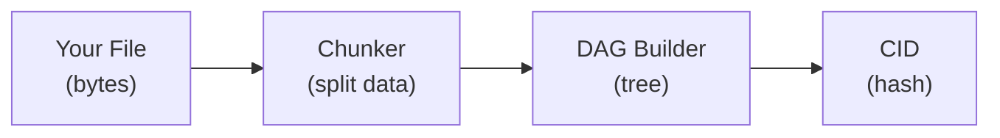
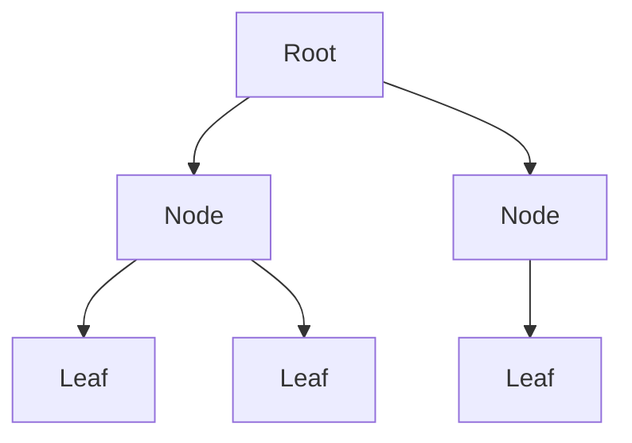
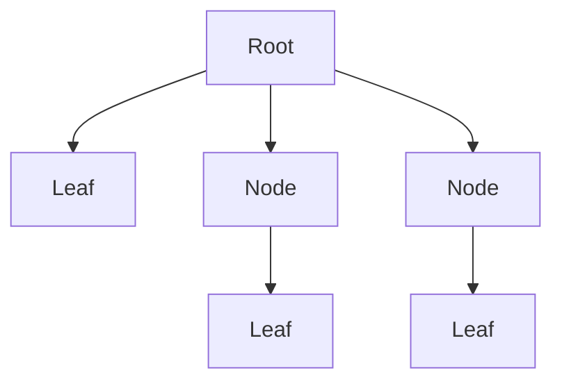
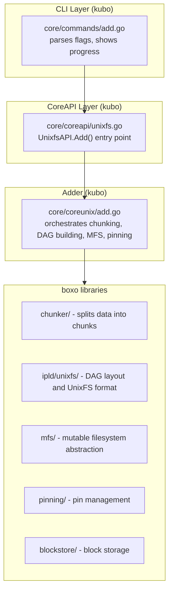

# How `ipfs add` Works

This document explains what happens when you run `ipfs add` to import files into IPFS. Understanding this flow helps when debugging, optimizing imports, or building applications on top of IPFS.

- [The Big Picture](#the-big-picture)
- [Try It Yourself](#try-it-yourself)
- [Step by Step](#step-by-step)
  - [Step 1: Chunking](#step-1-chunking)
  - [Step 2: Building the DAG](#step-2-building-the-dag)
  - [Step 3: Storing Blocks](#step-3-storing-blocks)
  - [Step 4: Pinning](#step-4-pinning)
  - [Alternative: Organizing with MFS](#alternative-organizing-with-mfs)
- [Options](#options)
- [UnixFS Format](#unixfs-format)
- [Code Architecture](#code-architecture)
  - [Key Files](#key-files)
  - [The Adder](#the-adder)
- [Further Reading](#further-reading)

## The Big Picture

When you add a file to IPFS, three main things happen:

1. **Chunking** - The file is split into smaller pieces
2. **DAG Building** - Those pieces are organized into a tree structure (a [Merkle DAG](https://docs.ipfs.tech/concepts/merkle-dag/))
3. **Pinning** - The root of the tree is pinned so it persists in your local node

The result is a Content Identifier (CID) - a hash that uniquely identifies your content and can be used to retrieve it from anywhere in the IPFS network.



## Try It Yourself

```bash
# Add a simple file
echo "Hello World" > hello.txt
ipfs add hello.txt
# added QmWATWQ7fVPP2EFGu71UkfnqhYXDYH566qy47CnJDgvs8u hello.txt

# See what's inside
ipfs cat QmWATWQ7fVPP2EFGu71UkfnqhYXDYH566qy47CnJDgvs8u
# Hello World

# View the DAG structure
ipfs dag get QmWATWQ7fVPP2EFGu71UkfnqhYXDYH566qy47CnJDgvs8u
```

## Step by Step

### Step 1: Chunking

Big files are split into chunks because:

- Large files need to be broken down for efficient transfer
- Identical chunks across files are stored only once (deduplication)
- You can fetch parts of a file without downloading the whole thing

**Chunking strategies** (set with `--chunker`):

| Strategy | Description | Best For |
|----------|-------------|----------|
| `size-N` | Fixed size chunks | General use |
| `rabin` | Content-defined chunks using rolling hash | Deduplication across similar files |
| `buzhash` | Alternative content-defined chunking | Similar to rabin |

See `ipfs add --help` for current defaults, or [Import](config.md#import) for making them permanent.

Content-defined chunking (rabin/buzhash) finds natural boundaries in the data. This means if you edit the middle of a file, only the changed chunks need to be re-stored - the rest can be deduplicated.

### Step 2: Building the DAG

Each chunk becomes a leaf node in a tree. If a file has many chunks, intermediate nodes group them together. This creates a Merkle DAG (Directed Acyclic Graph) where:

- Each node is identified by a hash of its contents
- Parent nodes contain links (hashes) to their children
- The root node's hash becomes the file's CID

**Layout strategies**:

**Balanced layout** (default):



All leaves at similar depth. Good for random access - you can jump to any part of the file efficiently.

**Trickle layout** (`--trickle`):



Leaves added progressively. Good for streaming - you can start reading before the whole file is added.

### Step 3: Storing Blocks

As the DAG is built, each node is stored in the blockstore:

- **Normal mode**: Data is copied into IPFS's internal storage (`~/.ipfs/blocks/`)
- **Filestore mode** (`--nocopy`): Only references to the original file are stored (saves disk space but the original file must remain in place)

### Step 4: Pinning

By default, added content is pinned (`ipfs add --pin=true`). This tells your IPFS node to keep this data - without pinning, content may eventually be removed to free up space.

### Alternative: Organizing with MFS

Instead of pinning, you can use the [Mutable File System (MFS)](https://docs.ipfs.tech/concepts/file-systems/#mutable-file-system-mfs) to organize content using familiar paths like `/photos/vacation.jpg` instead of raw CIDs:

```bash
# Add directly to MFS path
ipfs add --to-files=/backups/ myfile.txt

# Or copy an existing CID into MFS
ipfs files cp /ipfs/QmWATWQ7fVPP2EFGu71UkfnqhYXDYH566qy47CnJDgvs8u /docs/hello.txt
```

Content in MFS is implicitly pinned and stays organized across node restarts.

## Options

Run `ipfs add --help` to see all available options for controlling chunking, DAG layout, CID format, pinning behavior, and more.

## UnixFS Format

IPFS uses [UnixFS](https://specs.ipfs.tech/unixfs/) to represent files and directories. UnixFS is an abstraction layer that:

- Gives names to raw data blobs (so you can have `/foo/bar.txt` instead of just hashes)
- Represents directories as lists of named links to other nodes
- Organizes large files as trees of smaller chunks
- Makes these structures cryptographically verifiable - any tampering is detectable because it would change the hashes

With `--raw-leaves`, leaf nodes store raw data without the UnixFS wrapper. This is more efficient and is the default when using CIDv1.

## Code Architecture

The add flow spans several layers:



### Key Files

| Component | Location |
|-----------|----------|
| CLI command | `core/commands/add.go` |
| API implementation | `core/coreapi/unixfs.go` |
| Adder logic | `core/coreunix/add.go` |
| Chunking | [boxo/chunker](https://github.com/ipfs/boxo/tree/main/chunker) |
| DAG layouts | [boxo/ipld/unixfs/importer](https://github.com/ipfs/boxo/tree/main/ipld/unixfs/importer) |
| MFS | [boxo/mfs](https://github.com/ipfs/boxo/tree/main/mfs) |
| Pinning | [boxo/pinning/pinner](https://github.com/ipfs/boxo/tree/main/pinning/pinner) |

### The Adder

The `Adder` type in `core/coreunix/add.go` is the workhorse. It:

1. **Creates an MFS root** - temporary in-memory filesystem for building the DAG
2. **Processes files recursively** - chunks each file and builds DAG nodes
3. **Commits to blockstore** - persists all blocks
4. **Pins the result** - keeps content from being removed
5. **Returns the root CID**

Key methods:

- `AddAllAndPin()` - main entry point
- `addFileNode()` - handles a single file or directory
- `add()` - chunks data and builds the DAG using boxo's layout builders

## Further Reading

- [UnixFS specification](https://specs.ipfs.tech/unixfs/)
- [IPLD and Merkle DAGs](https://docs.ipfs.tech/concepts/merkle-dag/)
- [Pinning](https://docs.ipfs.tech/concepts/persistence/)
- [MFS (Mutable File System)](https://docs.ipfs.tech/concepts/file-systems/#mutable-file-system-mfs)
