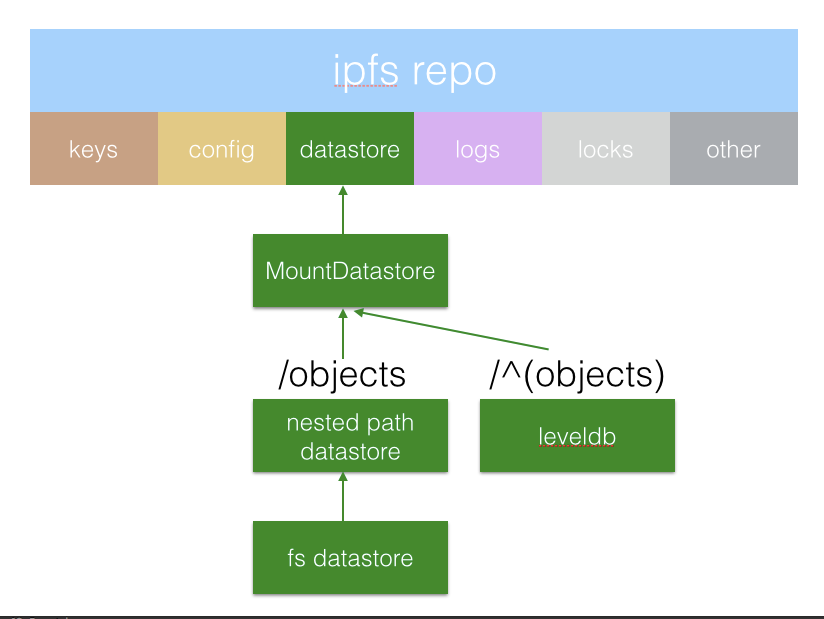

#  fs-repo

**Author(s)**:
- [Juan Benet](github.com/jbenet)
- [David Dias](github.com/daviddias)
- [Hector Sanjuan](github.com/hsanjuan)

**Abstract**

This spec defines `fs-repo` version `1`, its formats, and semantics.

# Table of Contents

- [Definition](#definition)
- [Contents](#contents)
  - [api](#api)
  - [blocks/](#blocks)
  - [config](#config)
  - [hooks/](#hooks)
  - [keystore/](#keystore)
  - [datastore/](#datastore)
  - [logs/](#logs)
  - [repo.lock](#repolock)
  - [version](#version)
- [Datastore](#datastore-1)
- [Notes](#notes)
  - [Location](#location)
  - [blocks/ with an fs-datastore](#blocks-with-an-fs-datastore)
  - [Reading without the `repo.lock`](#reading-without-the-repolock)

## Definition

`fs-repo` is a filesystem implementation of the IPFS [repo](repository.md).


## Contents


```
.ipfs/
├── api             <--- running daemon api addr
├── blocks/         <--- objects stored directly on disk
│   └── aa          <--- prefix namespacing like git
│       └── aa      <--- N tiers
├── config          <--- config file (json or toml)
├── hooks/          <--- hook scripts
├── keystore/       <--- cryptographic keys
│   ├── key_b32name <--- private key with base32-encoded name
├── datastore/      <--- datastore
├── logs/           <--- 1 or more files (log rotate)
│   └── events.log  <--- can be tailed
├── repo.lock       <--- mutex for repo
└── version         <--- version file
```

### api

`./api` is a file that exists to denote an API endpoint to listen to.
- It MAY exist even if the endpoint is no longer live (i.e. it is a _stale_ or left-over `./api` file).

In the presence of an `./api` file, ipfs tools (e.g. go-ipfs `ipfs daemon`) MUST attempt to delegate to the endpoint, and MAY remove the file if reasonably certain the file is stale. (e.g. endpoint is local, but no process is live)

The `./api` file is used in conjunction with the `repo.lock`. Clients may opt to use the api service, or wait until the process holding `repo.lock` exits. The file's content is the api endpoint as a [multiaddr](https://github.com/jbenet/multiaddr)

```
> cat .ipfs/api
/ip4/127.0.0.1/tcp/5001
```

Notes:
- The API server must remove the api file before releasing the `repo.lock`.
- It is not enough to use the `config` file, as the API addr of a daemon may
  have been overridden via ENV or flag.

#### api file for remote control

One use case of the `api` file is to have a repo directory like:

```
> tree $IPFS_PATH
/Users/jbenet/.ipfs
└── api

0 directories, 1 files

> cat $IPFS_PATH/api
/ip4/1.2.3.4/tcp/5001
```

In go-ipfs, this has the same effect as:

```
ipfs --api /ip4/1.2.3.4/tcp/5001 <cmd>
```

Meaning that it makes ipfs tools use an ipfs node at the given endpoint, instead of the local directory as a repo.

In this use case, the rest of the `$IPFS_PATH` may be completely empty, and no other information is necessary. It cannot be said it is a _repo_ per-se. (TODO: come up with a good name for this).

### blocks/

The `block/` component contains the raw data representing all IPFS objects
stored locally, whether pinned or cached. This component is controlled by the `
datastore`. For example, it may be stored within a leveldb instance in `
datastore/`, or it may be stored entirely with independent files, like git.

In the default case, the user uses fs-datastore for all `/blocks` so the
objects are stored in individual files. In other cases, `/blocks` may even be
stored remotely

- [blocks/ with an fs-datastore](#blocks-with-an-fs-datastore)

### config

The `config` file is a JSON or TOML file that contains the tree of
configuration variables. It MUST only be changed while holding the
`repo.lock`, or potentially lose edits.

### hooks/

The `hooks` directory contains executable scripts to be called on specific
events to alter ipfs node behavior.

Currently available hooks:

```
none
```

### keystore/


The `keystore` directory holds additional private keys that the node has
access to (the public keys can be derived from them).

The keystore repository should have `0700` permissions (readable, writable by
the owner only).

The key files are named as `key_base32encodedNameNoPadding` where `key_` is a
fixed prefix followed by a base32 encoded identifier, **without padding and
downcased**. The identifier usually corresponds to a human-friendly name given
by the user.

The key files should have '0400' permissions (read-only, by the owner only).

The `self` key identifier is reserved for the peer's main key, and therefore key named
`key_onswyzq` is allowed in this folder.

The key files themselves contain a serialized representation of the keys as
defined in the
[libp2p specification](https://github.com/libp2p/specs/blob/master/peer-ids/peer-ids.md#keys).

### datastore/

The `datastore` directory contains the data for a leveldb instance used to
store operation data for the IPFS node. If the user uses a `boltdb` datastore
instead, the directory will be named `boltdb`. Thus the data files of each
database will not clash.

TODO: consider whether all should just be named `leveldb/`

### logs/

IPFS implementations put event log files inside the `logs/` directory. The
latest log file is `logs/events`. Others, rotated out may exist, with a
timestamp of their creation. For example:


### repo.lock

`repo.lock` prevents concurrent access to the repo. Its content SHOULD BE the
PID of the process currently holding the lock. This allows clients to detect
a failed lock and cleanup.

```
> cat .ipfs/repo.lock
42
> ps | grep "ipfs daemon"
42 ttys000   79:05.83 ipfs daemon
```

**TODO, ADDRESS DISCREPANCY:** the go-ipfs implementation does not currently store the PID in the file, which in some systems causes failures after a failure or a teardown. This SHOULD NOT require any manual intervention-- a present lock should give new processes enough information to recover. Doing this correctly in a portable, safe way, with good UX is very tricky. We must be careful with TOCTTOU bugs, and multiple concurrent processes capable of running at any moment. The goal is for all processes to operate safely, to avoid bothering the user, and for the repo to always remain in a correct, consistent state.

### version

The `version` file contains the repo implementation name and version. This format has changed over time:

```
# in version 0
> cat $repo-at-version-0/version
cat: /Users/jbenet/.ipfs/version: No such file or directory

# in versions 1 and 2
> cat $repo-at-version-1/version
1
> cat $repo-at-version-2/version
2

# in versions >3
> cat $repo-at-version-3/version
fs-repo/3
```

_Any_ fs-repo implementation of _any_ versions `>0` MUST be able to read the
`version` file. It MUST NOT change format between versions. The sole exception is version 0, which had no file.

**TODO: ADDRESS DISCREPANCY:** versions 1 and 2 of the go-ipfs implementation use just the integer number. It SHOULD have used `fs-repo/<version-number>`. We could either change the spec and always just use the int, or change go-ipfs in version `>3`. we will have to be backwards compatible.

## Datastore

Both the `/blocks` and `/datastore` directories are controlled by the
`datastore` component of the repo.

## Notes

### Location

The `fs-repo` can be located anywhere on the filesystem. By default
clients should search for a repo in:

```
~/.ipfs
```

Users can tell IPFS programs to look elsewhere with the env var:

```
IPFS_PATH=/path/to/repo
```

### blocks/ with an fs-datastore



Each object is stored in its own file. The filename is the hash of the object.
The files are nested in directories whose names are prefixes of the hash, as
in `.git/objects`.

For example:
```sh
# multihashes
1220fe389b55ea958590769f9046b0f7268bca90a92e4a9f45cbb30930f4bf89269d # sha2
1114f623e0ec7f8719fb14a18838d2a3ef4e550b5e53 # sha1

# locations of the blocks
.ipfs/blocks/1114/f6/23/e0ec7f8719fb14a18838d2a3ef4e550b5e53
.ipfs/blocks/1220/fe/38/9b55ea958590769f9046b0f7268bca90a92e4a9f45cbb30930f4bf89269d
```

**Important Notes:**
- the hashes are encoded in hex, not the usual base58, because some
  filesystems are case insensitive.
- the multihash prefix is two bytes, which would waste two directory levels,
  thus these are combined into one.
- the git `idx` and `pack` file formats could be used to coalesce objects

**TODO: ADDRESS DISCREPANCY:**

the go-ipfs fs-repo in version 2 uses a different `blocks/` dir layout:

```
/Users/jbenet/.ipfs/blocks
├── 12200007
│   └── 12200007d4e3a319cd8c7c9979280e150fc5dbaae1ce54e790f84ae5fd3c3c1a0475.data
├── 1220000f
│   └── 1220000fadd95a98f3a47c1ba54a26c77e15c1a175a975d88cf198cc505a06295b12.data
```

We MUST address whether we should change the fs-repo spec to match go-ipfs in version 2, or we should change go-ipfs to match the fs-repo spec (more tiers). We MUST also address whether the levels are a repo version parameter or a config parameter. There are filesystems in which a different fanout will have wildly different performance. These are mostly networked and legacy filesystems.

### Reading without the `repo.lock`

Programs MUST hold the `repo.lock` while reading and writing most files in the
repo. The only two exceptions are:

- `repo.lock` - so clients may check for it
- `api` - so clients may use the API
